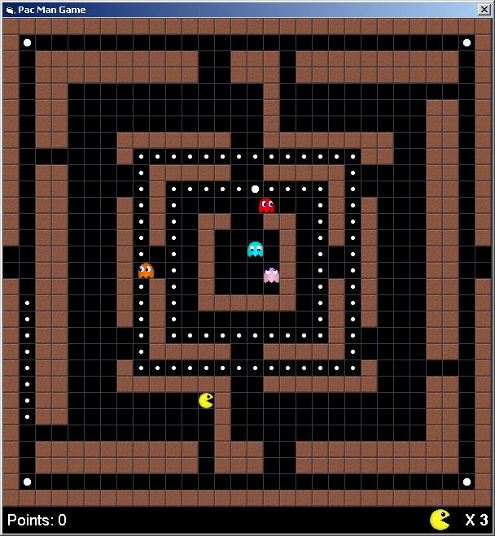



## Pacman with Level Editor

### Description

This is my version of Pacman. Thanks to all the people from this site that made this project possible. Try out the level editor and see how the enemies make their way around the course.
 
### More Info
 

             |
---                |---
**Submitted On**   |2003-11-17 16:40:16
**By**             |[Dino Scarcella](https://github.com/Planet-Source-Code/PSCIndex/blob/master/ByAuthor/dino-scarcella.md)
**Level**          |Intermediate
**User Rating**    |5.0 (45 globes from 9 users)
**Compatibility**  |VB 6\.0
**Category**       |[Games](https://github.com/Planet-Source-Code/PSCIndex/blob/master/ByCategory/games__1-38.md)
**World**          |[Visual Basic](https://github.com/Planet-Source-Code/PSCIndex/blob/master/ByWorld/visual-basic.md)
**Archive File**   |[Pacman\_wit16836312142003\.zip](https://github.com/Planet-Source-Code/dino-scarcella-pacman-with-level-editor__1-50450/archive/master.zip)

